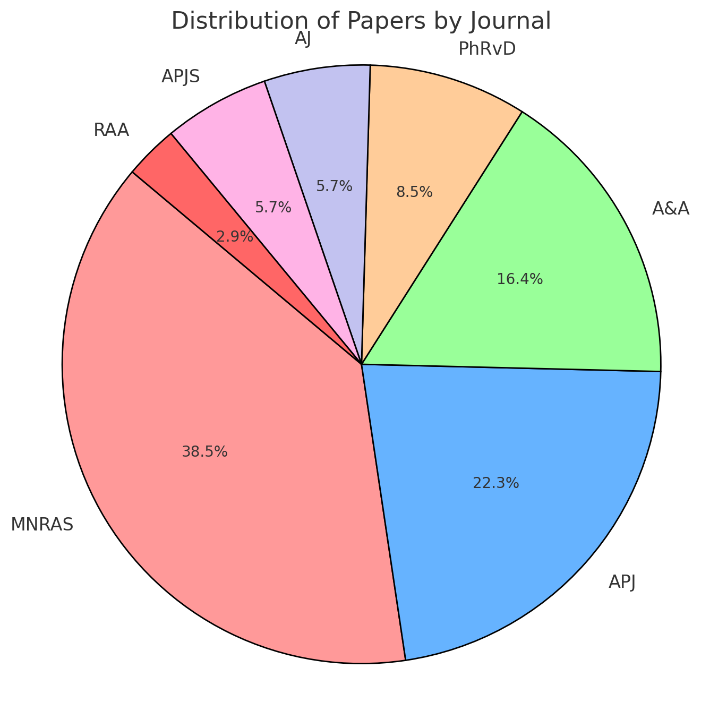
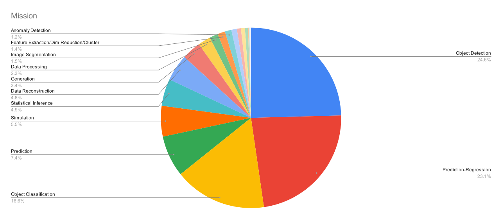
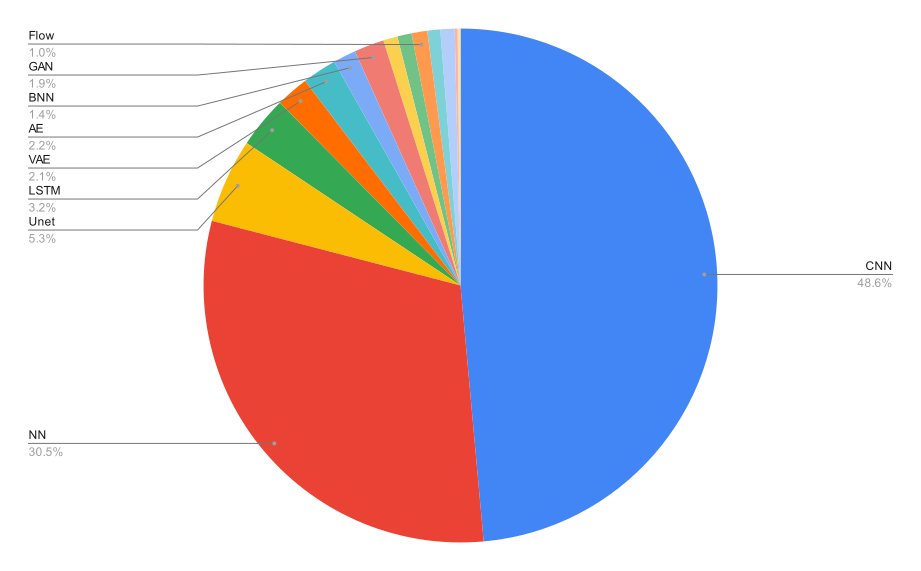
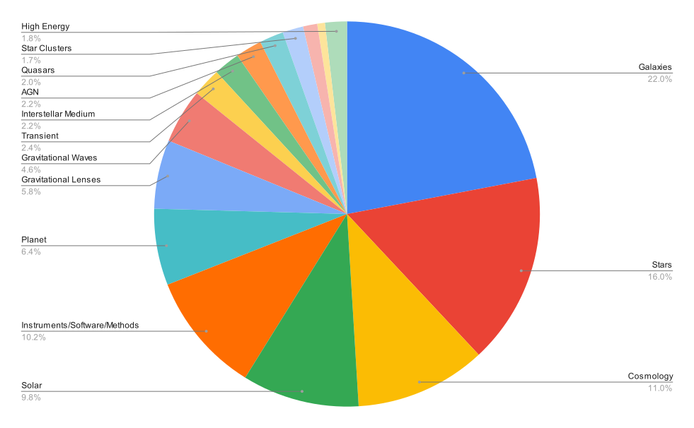
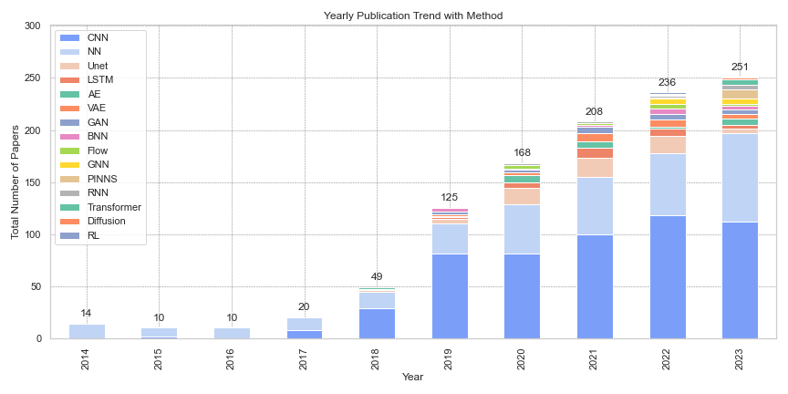

# 🌌AstrNNPapers
🪐 Here is a collection of astronomical papers involving neural network - Version 1.0.

- The entire dataset can be viewed [here](./dataset/AstrNNPapers_V1.md).
- Download the CSV format [here](./dataset/AstrNNPapers_V1.csv).

- Table-of-Contents
    * [📊Data Collection](#📊-data-collection)
    * [🧠Categorization of Machine Learning Tasks](#🧠-categorization-of-machine-learning-tasks-mission)
    * [🤖Categorization of Neural Network](#🤖-categorization-of-neural-network-methods)
    * [🔭Categorization of Astronomical Research Focus](#🔭-categorization-of-astronomical-research-focus-objects)
    * [📈Yearly Publication Trend and Analysis](#📈-yearly-publication-trend-analysis)

## 📊 Data Colletion
The V1 version of the paper collection was compiled by the end of 2023. The collection process was done via [NASA ADS](https://ui.adsabs.harvard.edu/), using an abstract search with the keyword "neural network," with the years set from 01/2014 to 01/2024. The collection was filtered for astronomy and limited to refereed publications.

**Search Query:**
```bash
abs:"neural network"
year:2014-2024
collection:astronomy
property:refereed
```
The query consists of 1,240 papers sourced from various journals. The pie chart below illustrates the distribution of these papers across the different journals.



The journals included are:

- **MNRAS**: 477 papers
- **APJ**: 276 papers
- **A&A**: 203 papers
- **PhRvD**: 106 papers
- **AJ**: 71 papers
- **APJS**: 71 papers
- **RAA**: 36 papers

🌟🌟🌟 The editor (Xingzhong Fan) reviewed each paper and selected 1,091 articles that applied neural network, categorizing each one based on '**Mission**', '**Methods**', and '**Object**'. 


## 🧠 Categorization of Machine Learning Tasks (Mission)

The table below categorizes the 1,091 papers based on their machine learning tasks:
|           Task Category                                | Number of Papers |                  Explanation                        |
|:------------------------------------------------------:|:----------------:|:--------------------------------------------------:|
|           Object Detection                             |        273       | Identifying objects within multimodal data         |
|         Prediction-Regression                          |        257       | Predicting continuous values                       |
|        Object Classification                           |        184       | Classifying objects into predefined categories     |
|              Prediction                                |        82        | Predicting future outcomes/discrete values          |
|              Simulation                                |        61        | Generating synthetic data or models of reality     |
|        Statistical Inference                           |        54        | Drawing conclusions from data using statistical methods |
|        Data Reconstruction                             |        53        | Rebuilding or estimating missing data              |
|              Generation                                |        38        | Creating new data based on learned models          |
|           Data Processing                              |        25        | Preparing and transforming raw data for analysis   |
|           Image Segmentation                           |        17        | Dividing an image into meaningful regions          |
|  Feature Extraction/Dim Reduction/Clustering           |        15        | Reducing data dimensions or grouping similar data  |
|           Anomaly Detection                            |        13        | Identifying unusual patterns or outliers           |
|           Image Refinement                             |        11        | Enhancing the quality of images                    |
|           Image Restoration                            |        8         | Recovering a clean image from noisy or corrupted versions |
|              Denoising                                 |        8         | Removing noise from data or images                 |
|           Explainable AI                               |        6         | Providing insights into how and why AI models make decisions       |
|              Optimization                              |        2         | Improving efficiency or performance in tasks       |
|           Recommender System                           |        1         | Suggesting items         |
|           Model Compression                            |        2         | Reducing the size of AI models while retaining accuracy |
|           Domain Adaptation                            |        1         | Adapting models to perform well across different domains |

Some papers involve multiple deep learning tasks and are therefore counted under different categories.

## 🤖 Categorization of Neural Network (Methods)

The table below categorizes the 1,091 papers based on the methods used:

|           Method                                      | Number of Papers |                  Explanation                        |
|:------------------------------------------------------:|:----------------:|:--------------------------------------------------:|
|           CNN                                         |        540       | Convolutional Neural Networks, widely used for image data  |
|           NN                                          |        339       | Neural Networks, general-purpose machine learning models |
|           Unet                                        |        59        | U-Net, primarily used for image segmentation tasks  |
|           LSTM                                        |        36        | Long Short-Term Memory, used for sequential data processing |
|           VAE                                         |        23        | Variational Autoencoders, used for generative models |
|           AE                                          |        24        | Autoencoders, used for unsupervised learning  |
|           BNN                                         |        16        | Bayesian Neural Networks, incorporating uncertainty into predictions |
|           GAN                                         |        21        | Generative Adversarial Networks, used for generative tasks |
|           PINNs                                       |        10        | Physics-Informed Neural Networks, incorporating physical laws into learning |
|           GNN                                         |        10        | Graph Neural Networks, used for graph-structured data |
|           Flow                                        |        11        | Normalizing Flows, used for generative modeling |
|           Transformer/Attention                       |        9         | Attention-based models, including Transformers |
|           RNN                                         |        10        | Recurrent Neural Networks, used for sequence modeling |
|           RL                                          |        2         | Reinforcement Learning, used for decision-making tasks in environments |
|           Diffusion                                   |        2         | Diffusion models, used for generative tasks |

Some papers involve multiple Neural Network methods and are therefore counted under different categories.

⭐⭐⭐ **For the detailed internal categorization of CNN and NN, see [here](./stats/network_details.md).**

## 🔭 Categorization of Astronomical Research Focus (Objects)

The table below categorizes the 1,091 papers based on their primary astronomical research focus:
|           Research Focus                              | Number of Papers |                  Explanation                        |
|:------------------------------------------------------:|:----------------:|:--------------------------------------------------:|
|           Galaxies                                    |        240       | Systems of stars, interstellar gas, dust, and dark matter bound together by gravity |
|           Stars                                       |        175       | Luminous spheres of plasma undergoing nuclear fusion in their cores |
|           Cosmology                                   |        120       | The study of the origin, evolution, and large-scale structure of the universe |
|           Solar                                       |        107       | The Sun and its related phenomena including solar activity and the heliosphere |
|           Instruments/Software/Methods                |        111       | Development of tools, algorithms, and methodologies for astronomical observations |
|           Planet                                      |        70        | Celestial bodies orbiting stars, including exoplanets and those within our solar system |
|           Gravitational Lenses                        |        63        | Massive objects that bend the light of background objects due to gravity, used to study mass distribution and dark matter |
|           Gravitational Waves                         |        50        | Ripples in spacetime caused by accelerating massive objects, such as merging black holes and neutron stars |
|           Transient                                  |        26        | Short-lived astronomical events such as supernovae, gamma-ray bursts, and fast radio bursts |
|           Interstellar Medium                         |        24        | The matter and radiation that exists in the space between stars within galaxies, primarily composed of gas and dust |
|           AGN (Active Galactic Nuclei)                |        24        | Extremely energetic regions at the centers of galaxies, powered by accretion onto supermassive black holes |
|           Quasars                                     |        22        | Highly luminous AGN powered by supermassive black holes in distant galaxies |
|           Star Clusters                               |        19        | Groups of stars that are gravitationally bound, including open and globular clusters |
|           Black Hole                                  |        13        | Regions of spacetime exhibiting such strong gravitational effects that nothing, not even light, can escape from them |
|           Dark Matter                                 |        7         | A form of matter thought to account for approximately 85% of the matter in the universe, detectable through its gravitational effects |
|           High Energy                                 |        20        | The study of astrophysical phenomena involving high-energy radiation such as X-rays, gamma rays, and cosmic rays |

## 📈 Yearly Publication Trend (Analysis)
When collecting the data, there were only 10 papers from January 2024. For ease of visualization, we have included all of them in 2023. Additionally, for papers that involve multiple methods, we have selected only the primary method.

The table below shows the number of papers published each year from 01/2014 to 01/2024:
| Year | Number of Papers |
|:----:|:----------------:|
| 2014 | 14               |
| 2015 | 10               |
| 2016 | 10               |
| 2017 | 20               |
| 2018 | 49               |
| 2019 | 125              |
| 2020 | 168              |
| 2021 | 208              |
| 2022 | 236              |
| 2023 | 251              |

### Stage I: 2014-2016 — 🌱 Initial Application of Shallow Neural Networks
From 2014 to 2016, the neural networks introduced in astronomy were mostly shallow networks, typically with fewer than three layers and only a few dozen neurons. During this stage, neural networks did not have an advantage over traditional machine learning methods, such as support vector machines (SVM) and random forests.

### Stage II: 2017-2018 — 🧱 Adoption of Basic CNNs and Conv1D
From 2017 to 2018, basic Convolutional Neural Networks (CNNs) were introduced and widely applied to image processing tasks. Conv1D was also used for handling time series data during this period. The complexity and parameter size of the networks increased significantly, and their performance began to rival traditional machine learning methods.

### Stage III: 2019-2020 — 🚀 Explosion of Deep Learning Applications
By 2019, the application of deep learning in astronomy entered a period of explosive growth. The key feature of this stage was the increasing use of deep learning to tackle tasks that traditional machine learning struggled with, such as complex image classification, object detection, and time series forecasting. During this period, we observed that CNN and NN architectures became more complex, with deeper networks and more layers, especially in handling large-scale astronomical datasets, where deep learning demonstrated significant potential. Models like **RNN** and **LSTM** also began to be applied for sequence data processing. Additionally, researchers started exploring explainable neural networks, such as **Bayesian Neural Networks (BNNs)**, providing astronomers with models capable of uncertainty estimation.  Furthermore, generative models like **VAE**, **GAN**, and **Flow** were introduced for tasks such as data generation and reconstruction. The significant increase in publications in 2019 and 2020 marked the widespread adoption of deep learning technologies in astronomy.

### Stage IV: 2021-2023 — 🔧 Advancement of Model Applications and Growth of Advanced Models
Starting in 2021, the growth rate of publications began to slow, as researchers increasingly relied on well-established models such as CNNs and NNs, achieving successful results across a wide range of astronomical tasks. Researchers also began leveraging the strengths of different models by combining multiple architectures to customize their networks for solving specific astronomical problems. However, as deep learning continued to evolve, more advanced models were gradually introduced. **Attention mechanisms (Transformers)** started being applied in astronomy, while generative models saw further development, with **VAE**, **Flow**, and **GAN** being increasingly utilized. **Diffusion models** were also introduced during this stage, showing great potential in generating astronomical images and data augmentation. **Graph Neural Networks (GNNs)** also began to be explored for handling structured astronomical data. Additionally, **Physics-Informed Neural Networks (PINNs)** started to be used to model physical phenomena, allowing researchers to integrate physical laws into deep learning models.

### Stage V: 2024 and Beyond — 🌐 Exploration of LLMs and Multimodal Models
Starting in 2024, it is noteworthy that deep learning in astronomy will further develop towards **Large Language Models (LLMs)** and multimodal foundational models. LLMs can create new applications, such as integrating expert knowledge to help researchers build intelligent agents, improving the efficiency of handling complex tasks. Meanwhile, multimodal foundational models can process various types of data, such as images, spectra, and time series, enhancing the model's generalization ability and solving more general tasks.