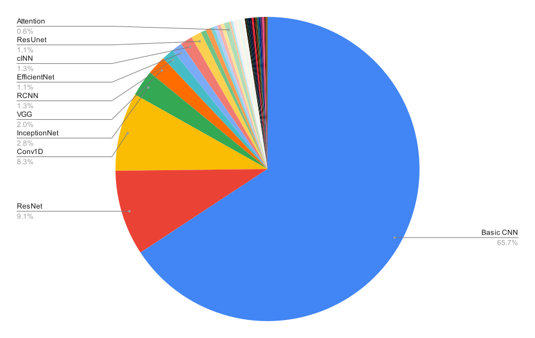

## [🏠 Back to Main Page](https://github.com/Xingzhongfan/AstrNNPapers)
# 🌠 Network Details

This document provides detailed information and internal categorizations of various neural network architectures used in the papers. The goal is to break down different types of networks (e.g., CNN, NN) and their subcategories, offering insights into their roles and applications in the research.

## Detailed Internal Categorizations of CNN

The table below categorizes the 540 papers based on more specific CNN architectures used:

|           CNN Architecture                           | Number of Papers |                  Explanation                        |
|:------------------------------------------------------:|:----------------:|:--------------------------------------------------:|
|           Basic CNN                                   |        355       | A standard Convolutional Neural Network model        |
|           ResNet                                      |        49        | Deep residual networks using skip connections        |
|           Conv1D                                      |        45        | 1D Convolutional Neural Networks for sequential data |
|           InceptionNet                                |        15        | A deep CNN architecture with inception modules       |
|           VGG                                         |        11        | A simple, deep CNN architecture                      |
|           RCNN                                        |        7         | Region-based CNN for object detection                |
|           EfficientNet                                |        6         | A more efficient deep learning architecture          |
|           cINN                                        |        7         | Conditional Invertible Neural Networks               |
|           ResUnet                                     |        6         | A combination of ResNet and U-Net                    |
|           cGAN                                        |        3         | Conditional GAN architecture                         |
|           CNN3D                                       |        3         | 3D Convolutional Neural Networks                     |
|           V-Net                                       |        2         | V-shaped neural network architecture for segmentation|
|           DenseNet                                    |        2         | Dense connectivity between layers                    |
|           ConvLSTM                                    |        2         | LSTM integrated with convolutional layers            |
|           BayesCNN                                    |        2         | Bayesian Convolutional Neural Networks               |
|           Attention                                   |        3         | CNN integrated with attention mechanisms             |
|           YOLO                                        |        1         | You Only Look Once, a real-time object detection model|
|           Xception                                    |        1         | A CNN architecture based on depthwise separable convolutions |
|           WDCNN                                       |        1         | Weighted Deep CNN                                    |
|           VETNET                                      |        1         | A specific CNN for veterinary images                 |
|           TransCNN                                    |        1         | Transformer-based CNN architecture                   |
|           TCN                                         |        2         | Temporal Convolutional Networks                      |
|           SSCNNs                                      |        1         | Sparse Submanifold CNNs                     |
|           SDNN                                        |        1         | Symmetric Deep Neural Networks                         |
|           SCNet                                        |        1         | A specific CNN (Stellar Classification Network)        |
|           Pix2PixCC                                   |        1         | A CNN for image-to-image translation tasks           |
|           MICNN                                       |        1         | Multi-input CNN                                   |
|           MDCNN                                       |        1         | Mixture Density CNN                                |
|           InceptionResNet                             |        1         | A hybrid of InceptionNet and ResNet                  |
|           Grad-CAM                                    |        1         | Gradient-weighted Class Activation Mapping for visual explanations |
|           G-CNNs                                      |        1         | Group Equivariant CNNs                               |
|           Faster R-CNN                                |        1         | A faster variant of Region-based CNN                 |
|           Encoder-Decoder                             |        1         | Encoder-decoder architecture with CNN layers         |
|           D3M                                         |        1         | Deep Density Displacement Model              |
|           CRNN                                        |        1         | Convolutional Recurrent Neural Networks              |
|           ConViT                                      |        1         | Convolutional Vision Transformer                     |
|           AANet                                       |        1         | A specific CNN architecture with adaptive attention  |

## Detailed internal categorizations of NN

The table below categorizes the 339 papers based on more specific NN architectures used:

|           NN Architecture                              | Number of Papers |                  Explanation                        |
|:------------------------------------------------------:|:----------------:|:--------------------------------------------------:|
|           Shallow NN                                   |        71        | A basic neural network with fewer layers            |
|           MLP (Multilayer Perceptron)                  |        229       | A class of feedforward neural networks with multiple layers |
|           SOM (Self-Organizing Maps)                   |        7         | A type of unsupervised learning algorithm            |
|           MDN (Mixture Density Networks)               |        7         | A probabilistic model combining neural networks and mixture models |
|           INN (Invertible Neural Networks)             |        2         | Networks capable of reversing their computations    |
|           GPRN (Gaussian Process Regression Networks)  |        2         | Combines Gaussian processes with neural networks     |
|           GRU (Gated Recurrent Units)                  |        3         | A type of RNN architecture for sequential data      |
|           SENet (Squeeze-and-Excitation Networks)      |        1         | Improves the quality of representations by recalibrating channel-wise features |
|           RIM (Recurrent Inference Machines)           |        2         | Neural network designed for iterative inference      |
|           RegNetX-CBAM3                                |        1         | A variation of RegNet with convolutional block attention |
|           PNN (Probabilistic Neural Networks)          |        1         | A type of supervised learning model for classification |
|           Physical_gridDNN                             |        1         | Neural networks used for physical grid-based data   |
|           LSNN (Liquid State Neural Networks)          |        1         | A type of spiking neural network                     |
|           IMNN (Information Maximising Neural Networks)|        2         | Maximizes information in unsupervised learning       |
|           HNN (Hamiltonian Neural Networks)            |        1         | Neural networks designed to conserve energy and momentum |
|           HDN (Hierarchical Deep Networks)             |        1         | A deep learning model with hierarchical structure    |
|           DenseCRF                                     |        1         | Neural network combined with Conditional Random Fields (CRFs) |
|           GMDH (Group Method of Data Handling)         |        1         | A type of self-organizing neural network             |
|           DQN (Deep Q-Networks)                        |        1         | A neural network architecture for reinforcement learning |
|           Deep-SANNE                                   |        1         | Deep Solar ALMA Neural Network Estimator |
|           Continuous Neural Fields                     |        1         | A model used for continuous data fields              |
|           ADMM-Net                                     |        1         | Networks using Alternating Direction Method of Multipliers for optimization |
|           NARX (Nonlinear Autoregressive Exogenous Model)|       1         | A recurrent dynamic model for time-series data       |